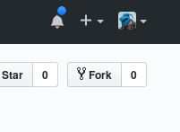
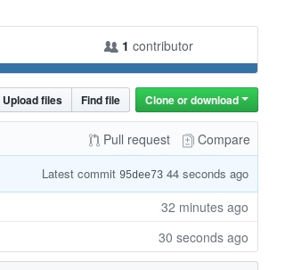
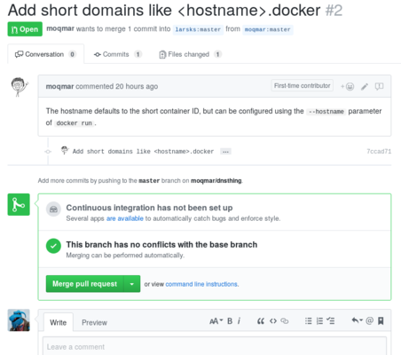

# Forking and Pull Requests

---

# A better workflow for collaboration

In the previous slides, we all shared a single remote repository. That
works okay for small groups, but isn't an option for a project with
many contributors.

The "pull request" model allows anyone to contribute to a project in a
controlled fashion (and even in small groups, it enables things like
automated testing before commits are merged).

---

# GitHub: Forking a project

"Forking" a repository makes a copy of someone else's repository in
your GitHub account.

- Go to <https://github.com/redhat-git-tutorial/redhat-git-example-2>.

- Select the "Fork" button in the upper right of the screen.

  

This will create a copy of the repository in your own GitHub account.

---

# GitHub: Cloning a repository

Now that you've forked the project, you would like to contribute some
changes. You'll need a local copy of the repository in order to edit
files.

```
git clone https://github.com/YOUR_USER_NAME/redhat-git-example-2
```

You'll end up with a folder named `redhat-git-example-2` on your
computer.

---

# GitHub: Make some changes

Each person will do one of these things:

- Add a list of participants to the `README.md` file.
- Add a comment to the first line of the `example.py` file.
- Change the string in the existing `print` statement.
- Add a second `print` statement right under the first one.

---

# GitHub: Pushing your changes

- Add the files that have been modified:

  ```
  git add example.py
  ```

- Commit the changes:

  ```
  git commit
  ```

- Push the changes:

  ```
  git push
  ```

---

# GitHub: Creating a pull request

Right now, there are a bunch of separate changes in a bunch of
separate repositories.  We want to contribute these changes back to
the original ("upstream") repository.

- Go back to the repository in your browser and reload the page.  You
  should see a "Pull request" link just above the list of files:

  

---

# GitHub: Creating a pull request

- Select the "Pull request" link.

- On the following screen, select the "Create pull request" button.

This will create a pull request in the upstream repository.

---

# GitHub: Approving changes

A maintainer can approve (or not!) the request to merge the changes
into the upstream repository.



---

# GitHub: Synchronizing your fork

The maintainer of the upstream project has approved a number of pull
requests. You would like your fork to reflect these changes.

- Create a new remote pointing at the upstream repository.

  ```
  git remote add upstream https://github.com/redhat-git-tutorial/redhat-git-example-2
  ```

- Tell git to download the remote repository:

  ```
  git remote update
  ```

- Merge the changes into your repository:

  ```
  git merge upstream/master
  ```
