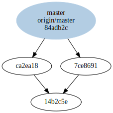

# Merge conflicts

Let's say we start with a file `example.py` in a remote repository
that looks like this:

```python
def main():
    print('Hello World.')

if __name__ == '__main__':
    main()
```

Bob and Alice have both cloned this locally and are making changes.

---

# Merge conflicts

Alice changes the file so that it looks like this:

```python
def main():
    print('This is a very contrived example.')

if __name__ == '__main__':
    main()
```

She commits her changes:

```
$ git add example.py
$ git commit -m 'This is an awful commit message'
[master add99f4] This is an awful commit message
 1 file changed, 1 insertion(+), 1 deletion(-)
```

---

# Merge conflicts

Alice pushes her changes back to the remote repository:

```
$ git push
Counting objects: 3, done.
Delta compression using up to 8 threads.
Compressing objects: 100% (2/2), done.
Writing objects: 100% (3/3), 347 bytes | 347.00 KiB/s, done.
Total 3 (delta 0), reused 0 (delta 0)
To upstream
   14b2c5e..ca2ea18  master -> master
```

---

# Merge conflicts

Meanwhile, Bob has changed his file so that it looks like this:

```python
def main():
    print('Hello Boston!')

if __name__ == '__main__':
    main()
```

He commits his changes...

```
$ git add example.py
$ git commit -m 'Boston is pretty awesome.'
[master 7ce8691] Boston is pretty awesome.
 1 file changed, 1 insertion(+), 1 deletion(-)
```

...and then tries to push them to the remote repository.

---

# Merge conflicts

Unfortunately, Alice got there first.

```
$ git push
To upstream
 ! [rejected]        master -> master (fetch first)
error: failed to push some refs to 'upstream'
hint: Updates were rejected because the remote contains work that you do
hint: not have locally. This is usually caused by another repository pushing
hint: to the same ref. You may want to first integrate the remote changes
hint: (e.g., 'git pull ...') before pushing again.
hint: See the 'Note about fast-forwards' in 'git push --help' for details.
```

Bob is not surprised! This just means that the remote repository has
more recent changes that it did when Bob last pulled it.  Bob knows
that all he has to do is merge those changes into his local
repository.

---

# Merge conflicts

Bob attempts to merge the remote changes:

```
$ git pull
remote: Counting objects: 3, done.
remote: Compressing objects: 100% (2/2), done.
remote: Total 3 (delta 0), reused 0 (delta 0)
Unpacking objects: 100% (3/3), done.
From upstream
   eef204c...ca2ea18 master     -> origin/master
CONFLICT (content): Merge conflict in example.py
Automatic merge failed; fix conflicts and then commit the result.
```

Oh no, a conflict! This means that Bob and Alice have made changes to
overlapping lines in the same file.

---

# Merge conflicts

At this point, `git` has annotated the file to show the conflict:

```python
def main():
<<<<<<< HEAD
    print('Hello Boston!')
=======
    print('This is a very contrived example.')
>>>>>>> ca2ea182084c582d4c870f31b4e894e894337dcb

if __name__ == '__main__':
    main()
```

Bob has a decision to make.

---

# Merge conflicts

Bob decides that since variety is the spice of life, the program
should print *both* messages. He modifies the program to look like:

```python
def main():
    print('Hello Boston!')
    print('This is a very contrived example.')

if __name__ == '__main__':
    main()
```

And then commits the result:

```
$ git add example.py
$ git commit
```

This will bring up an editor allowing him to edit the commit message,
and will then commit the changes.

---

# Merge conflicts

Bob can now push the changes back to the remote repository.

```
$ git push
Counting objects: 6, done.
Delta compression using up to 8 threads.
Compressing objects: 100% (4/4), done.
Writing objects: 100% (6/6), 665 bytes | 665.00 KiB/s, done.
Total 6 (delta 1), reused 0 (delta 0)
To upstream
   ca2ea18..84adb2c  master -> master
```

---

# Merge conflicts

The history of the project now looks like this:

```
commit 84adb2ce8698166855ecd69b24b2716353f0ffa7 (HEAD -> master, origin/master)
Merge: 7ce8691 ca2ea18
Author: Bob <bob@example.com>
Date:   Tue Apr 3 23:06:34 2018 -0400

    Merge branch 'master' of .../upstream

commit 7ce8691d997b2bb0b0d2a96e9093f5d7a952a99b
Author: Bob <bob@example.com>
Date:   Tue Apr 3 23:05:15 2018 -0400

    Boston is pretty awesome.

commit ca2ea182084c582d4c870f31b4e894e894337dcb
Author: Alice <alice@example.com>
Date:   Tue Apr 3 23:04:40 2018 -0400

    This is an awful commit message

commit 14b2c5ec20dae1e22efbf48d9854f861211bf628
Author: Alice <alice@example.com>
Date:   Tue Apr 3 23:04:14 2018 -0400

    initial commit
```

---

# Merge conflicts

The state of the repository for people who like pictures:



