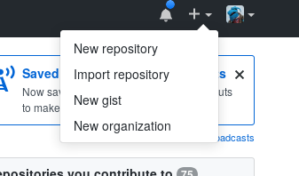
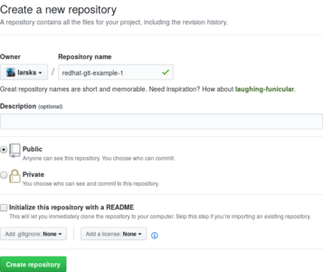

# Git.

(https://redhat-git-tutorial.github.io/slides/)

---

# Introductions

- Who am I?

  - <lars@redhat.com>
  - https://github.com/larsks
  - http://blog.oddbit.com/

- Who are you?

---

# What is git anyway?

- It's a *version control system*, or *VCS*.

- A version control system is a way of tracking changes to one or more
  files.

- Have you ever done this?

        cp myfile.py myfile.py.20180327

  That's a form of version control (but not very effective in the long
  term).

---

# What can do you with git?

- Collaborate with other people on a project.

- Explore different solutions to a problem.

- Roll back your code to some point in the past (infinite undo!).

- Fix bugs in older versions of your project without compromising your
  ability to make new features.

- Figure out which change made things stop working.

- Understand who has contributed to a project.

---

# Vocabulary

- **Repository**

    (n) A collection of files and their change history.

- **Commit**

    (n) A set of changes to your **repository**. "The problem is fixed
    in the most recent **commit**."

    (v) To update your **repository** with a new set of changes.
    "I will **commit** the change as soon as it seems to be working
    properly."

- **Branch**

    (n) A named series of **commits** in your **repository**. "The new
    implementation is in the 'testing' **branch**."

---

# Vocabulary

- **Remote**

    (n) A named remote repository. "Cloning a remote repository will
    usually create a **remote** named *origin*."

- **Pull**

    (v) Receive changes from a remote **repository**. "Make sure you
    *pull* from the remote **repository** before starting work on a
    major new feature."

- **Push**

    (v) Send changes to a remote **repository**. "Please **push** your
    changes before you leave for the weekend."

---

# Vocabulary

- **Clone**

    (v) To make a copy of a remote **repository**.  "You must
    **clone** the repository before you can make changes."

- **Fork**

    (n) A diverging copy of a **repository**.  "This project started
    out as a **fork** of ImageMagick."

    (v) To create a diverging copy of a **repository**.  "Before
    submitting a **pull request**, **fork** this **repository** and 
    **commit** your changes there."

- **Pull request**

    (n) A set of one or more **commits** that can be merged into 
    **branch** of a **repository**. "Alice has submitted a **pull
    request** that fixes the problem."

---

# Vocabulary

These last few vocabulary entries aren't particular to `git`, but
they're important topics that I hope we'll have time to discuss.

- **Continuous Integration** (**CI**)

    (n) The use of technologies such as automated testing to allow
    changes to a project to be published as often as possible.

- **Continuous Delivery** (**CD**)

    (n) An extension of **continuous integration** that includes
    processes to automate your release process.

---

# Installing git

- If you have MacOS: Just run `git`, and then follow the prompts to
  install the developer tools.

- If you have Red Hat/Fedora/CentOS:

  ```
  sudo yum install git
  ```

- If you have Ubuntu:

  ```
  sudo apt-get update
  sudo apt-get install git
  ```

---

# Installing git

If you have Windows:

- Go to <https://git-scm.com/download/win>
- Run the installer

---

# Getting started: telling git who you are

Git needs to know who you are in order to identify you in your commit
messages.  Run the following commands to configure this information:

```
git config --global user.name "Your Name Here"
git config --global user.email you@your.email.address
```

---

# Getting started: Using git locally

You're about to start a new project and you want to use version
control from the very beginning because you're just that awesome:

```
git init MyProject
```

You have an existing project and you realize how much easier and more
productive your life would be if you were to track your changes with
git:

```
cd MyProject
git init
git add .
git commit -m 'Initial import'
```

---

# Making changes: adding files

After working on your project for a bit, you now have a couple of
files of source code.

In `README.md` you have:

```markdown
# My first git project

This is an example for the git tutorial at Red Hat.
```

And in `example.py` you have:

```python
print('Hello world!')
```

---

name: adding

# Making changes: adding files

You want `git` to manage changes to these files.

- Tell `git` that you want to commit these files to your repository:

  ```
  git add example.py README.md
  ```

- Commit the files with an appropriate commit message:

  ```
  git commit
  ```

  This will open an editor into which you can enter a commit message.
  Alternately, you can provide one on the command line:

  ```
  git commit -m 'This will be an awesome project.'
  ```

---

# Interlude: commit messages

A commit message should succinctly describe the changes included in
that particular commit.  There is a canonical format for commit
messages that is useful to follow:

```
A one line summary of the commit.

One or more paragraphs describing the commit.  What did you
change? Why did you change it?
```

---

# Interlude: commit messages

This is not a good commit message:

    Fixed a bug.

This is a better commit message.

    Fixed bug that was causing connections to abort with an error.

    In myproject/connection.py, we didn't account for situations in
    which we received an empty first line, resulting in an IndexError
    exception. This commit checks for that situation and exits
    gracefully.

---

# Making changes: edit your files

Modify `example.py` so that it looks like this:

```python
def main():
    print('Hello world!')

if __name__ == '__main__':
    main
```

---

# Making changes: what changed?

You've been hacking on your project for hours.  You'd like an overview
of what you changed.

To see a list of modified files, use `git status`:

```
$ git status
On branch master

Changes not staged for commit:
  (use "git add <file>..." to update what will be committed)
  (use "git checkout -- <file>..." to discard changes in working directory)

	modified:   example.py
```

---

# Making changes: what changed?

To see the actual modifications, use `git diff`:

```
diff --git a/example.py b/example.py
index 60f08aa..492b359 100644
--- a/example.py
+++ b/example.py
@@ -1 +1,5 @@
-print('Hello world!')
+def main():
+    print('Hello world!')
+
+if __name__ == '__main__':
+    main
```

---

# Making changes: saving your changes

After making changes, don't forget to [add and commit](#adding) those
changes.

---

# Viewing history

You would like to view the history of a git repository.  Use `git
log`:

```
$ git log
commit add09696954b831fbcad4d9f713142699e3da6ec (HEAD -> master, origin/master, origin/HEAD)
Author: Lars Kellogg-Stedman <lars@redhat.com>
Date:   Wed Apr 4 00:04:46 2018 -0400

    wrap output statement in a function call

    moving our code into a function allows one to import this module. See
    https://docs.python.org/3/library/__main__.html for details.

commit 03f371c82be4f34c5bae361e30d3de8f38a5eeaa
Author: Lars Kellogg-Stedman <lars@redhat.com>
Date:   Tue Apr 3 23:04:14 2018 -0400

    initial commit
```

---

# Branches: Exploring different solutions

You want to explore a solution to a problem while still preserving the
current state of your project. You can do this by creating a new
"branch".

- Your project already has one branch named `master`.

- You can create a new branch like this:

  ```
  git checkout -b my-new-branch
  ```

Any changes you commit at this point will modify your `my-new-branch`
branch, leaving your `master` branch untouched.

---

# Branches: Changing branches

You can switch branches with the `git checkout` command.  To switch
back to the `master` branch:

```
git checkout master
```

And back to `my-new-branch`:

```
git checkout my-new-branch
```

The `git status` command will tell you where you are if you forget:

```
On branch my-new-branch
nothing to commit, working tree clean
```

---

# Branches: what changed?

You can use the `git diff` command to see the differences between two
branches.

```
git checkout my-new-branch
git diff master
```

---

# Branches: merging changes

After working on a solution for a while, you think you've solved the
problem and you would like to commit those changes on your `master`
branch.

- Check out the `master` branch:

  ```
  git checkout master
  ```

- Merge the changes:

  ```
  git merge my-new-branch
  ```

---

# Collaborating with others: Sharing code on GitHub

[GitHub][] is a hosting provider for git repositories.  We're going to
walk through an example in which we use GitHub to collaborate on a
project.

[github]: https://github.com

---

# GitHub: Create an account

- Go to <https://github.com>

- Pick a username and password and provide your email address.

- Select the "Sign up for GitHub" button.

- Select "Continue" on the next screen.

- Select "skip this step" on the final screen.

(You will get an email asking you to verify your email address.)

---

# Interlude: Authentication

When you interact with a remote repository, that remote system needs
to verify that you are really you. There are different ways of doing
that; today we'll be using passwords.  It's annoying if you have to
type in your password every time you run a remote command.  This will
help:

```
git config --global credential.https://github.com.username yourusername
git config --global credential.helper 'cache'
```

---

# GitHub: Create a repository

- Navigate to https://github.com/

- Click on the "+" in the upper right and select "New repository".

  

---

# GitHub: Create a repository

- Give your project a name (and optionally a description).

  

- Select the "Create repository" button.

---

# GitHub: Push your local repository

- Configure your GitHub repository as a **remote** in your local
  repository:

  ```
  git remote add origin https://github.com/larsks/redhat-git-example.git
  ```

  This creates a **remote** named "origin", which is the canonical name
  for the primary remote of a git repository.

- Push your project to the remote:

  ```
  git push -u origin master
  ```

  This tells git to push your local `master` branch to the remote named
  `origin`, and to make this the default destination so that in the
  future we can just type:

  ```
  git push
  ```

---

# GitHub: Cloning a remote repository

We're all going to collaborate on a single project.

- Clone the remote repository:

  ```
  git clone https://github.com/redhat-git-tutorial/redhat-git-example-2
  ```

  This will create a folder named `redhat-git-example-2` on your local
  computer.

---

# GitHub: Make some changes

Each person will do one of these things:

- Add a list of participants to the `README.md` file.
- Add a comment to the first line of the `example.py` file.
- Change the string in the existing `print` statement.
- Add a second `print` statement right under the first one.

---

# GitHub: Push your changes

- Add the files that have been modified:

  ```
  git add example.py
  ```

- Commit the changes:

  ```
  git commit
  ```

- Try to push the changes:

  ```
  git push
  ```

---

# GitHub: Push your changes

If you were the first person to run `git push`, it worked without a
problem.  Everyone else saw something that looked like this:

```
$ git push
To https://github.com/redhat-git-tutorial/redhat-git-example-2
 ! [rejected]        master -> master (fetch first)
error: failed to push some refs to 'https://github.com/redhat-git-tutorial/redhat-git-example-2'
hint: Updates were rejected because the remote contains work that you do
hint: not have locally. This is usually caused by another repository pushing
hint: to the same ref. You may want to first integrate the remote changes
hint: (e.g., 'git pull ...') before pushing again.
hint: See the 'Note about fast-forwards' in 'git push --help' for details.
```

This just means that the remote repository has changed since we cloned
it.  We need to update our local repository with those changes.

---

# GitHub: Synchronizing your changes

You can synchronize your local repository with a remote repository by
running:

```
git pull
```

Which will result in output like:

```
remote: Counting objects: 3, done.
remote: Compressing objects: 100% (2/2), done.
remote: Total 3 (delta 1), reused 3 (delta 1), pack-reused 0
Unpacking objects: 100% (3/3), done.
From https://github.com/larsks/redhat-git-example-2
   95dee73..baa29b5  master     -> origin/master
First, rewinding head to replay your work on top of it...
Applying: modified comment
```

Git has combined your local changes with the changes that were in the
remote repository.

---

# GitHub: Synchronizing your changes

Now you can push your changes:

```
git push
```

---

# Resources

- The Official Git Book: https://git-scm.com/book/
- Command reference: https://git-scm.com/docs
- Interactive git tutorial: https://try.github.io/
